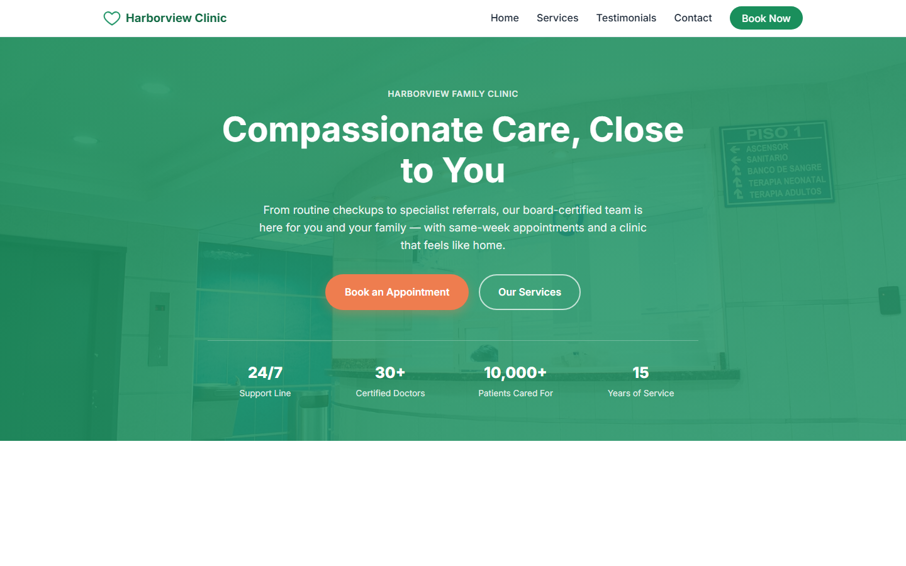

# Harborview Family Clinic

A static, single-page marketing website for a fictional healthcare clinic. Built with plain HTML, CSS, and JavaScript — no framework, no build step, no dependencies.

**Live site:** https://okkyprayitna.github.io/Healthcare/



## Features

- Sticky, responsive navbar with a mobile hamburger menu, smooth-scroll anchor links, and a beacon-mark logo
- Hero section with an animated "beacon" signature graphic (rotating light sweep, pulsing horizon dot), dual call-to-action buttons, and a trust-indicator strip with a count-up animation
- Why-Choose-Us section calling out same-week appointments, board-certified specialists, transparent pricing, and dedicated care coordinators
- Services section highlighting general checkups, pediatrics, cardiology, and dental care
- Patient testimonials with initials avatars and star ratings
- Appointment enquiry form with client-side validation (inline error messages, no `alert()`), submitted via Formspree so enquiries are emailed automatically, with success/error states and a link to a free New Patient Checklist
- Post-submission celebration — a spoken thank-you message (Web Speech API) and a floating balloon animation, both skipped under `prefers-reduced-motion`
- Floating WhatsApp chat widget with quick-reply shortcuts, present on both `index.html` and `new-patient-checklist.html`
- `new-patient-checklist.html` — a standalone, printable lead-magnet page (`noindex`) with checkable prep lists
- Scroll-triggered fade-in animations via `IntersectionObserver`, with `prefers-reduced-motion` respected throughout
- Footer with quick links, social placeholders, and a JS-injected copyright year

## Tech stack

- **HTML5** — semantic markup (`index.html`, `new-patient-checklist.html`)
- **CSS3** — custom properties (ink-navy/brass/cream palette), mobile-first layout with breakpoints at 640px / 768px / 992px (`styles.css`)
- **Vanilla JavaScript** — no libraries (`script.js`), using the native Web Speech API for the post-submit voice message
- **Fonts** — Fraunces (display) + Inter (body), loaded from Google Fonts
- **Formspree** — third-party form-to-email backend for the enquiry form (no server code of our own)

## Project structure

```
├── index.html                  # homepage markup
├── new-patient-checklist.html  # printable lead-magnet page, linked from the enquiry form
├── styles.css                  # all styling
├── script.js                   # all behavior
├── favicon.svg                 # beacon-mark favicon
├── robots.txt, sitemap.xml     # basic SEO
├── assets/screenshot.png       # homepage preview used in this README
├── .mcp.json                   # project-level Playwright MCP server config
├── .claude/agents/             # project-level Claude Code subagent definitions (security-auditor, ui-ux-reviewer)
└── CLAUDE.md                   # guidance for AI coding agents working in this repo
```

## Running locally

No build tooling is required. Open `index.html` directly in a browser:

```bash
start index.html   # Windows
```

## Deployment

The site is deployed to GitHub Pages automatically via GitHub Actions (`.github/workflows/deploy.yml`) on every push to `main`.

## Notes

The enquiry form has no server of its own — on submit, `initEnquiryForm` in `script.js` validates the fields client-side, then POSTs the data directly to a Formspree endpoint (`https://formspree.io/f/xgojbljq`), which emails the submission on to the clinic. There's no way to swap the destination email without creating a new Formspree form and updating that endpoint in `script.js`.
